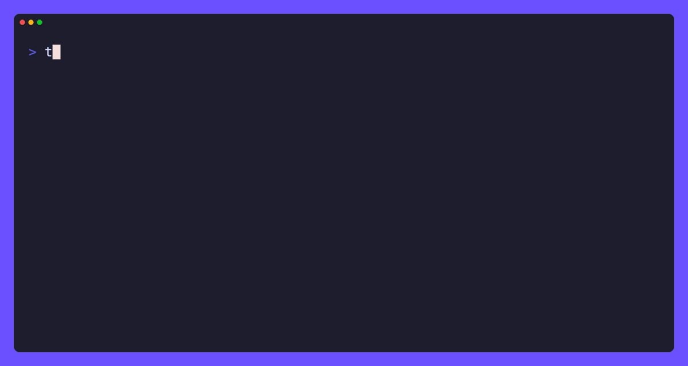

# Tasia
Harden private AI stacks before they ship.

Tasia reviews local/private AI deployment configs, flags risky exposure patterns, blocks unsafe pushes, and generates a hardening pack your team can act on.

Private AI is not automatically private.



## Install

**No Go toolchain required — download a prebuilt binary:**

```bash
# macOS (Apple Silicon) example — pick the asset matching your OS/arch
VERSION=v0.1.0
curl -sSfL "https://github.com/dzh01/tasia/releases/download/${VERSION}/tasia_${VERSION#v}_darwin_arm64.tar.gz" | tar xz
sudo mv tasia /usr/local/bin/
tasia version
```

Prebuilt binaries are published for `darwin_arm64`, `darwin_amd64`, `linux_amd64`,
and `linux_arm64` on every release, with a `checksums.txt` to verify downloads.
Browse them at **https://github.com/dzh01/tasia/releases**.

**With Go:**

```bash
go install github.com/dzh01/tasia/cmd/tasia@latest
```

**From source:**

```bash
git clone https://github.com/dzh01/tasia
cd tasia
go build -o tasia ./cmd/tasia
```

## Quickstart

```bash
# Review a directory
tasia review --path .

# Example on a known-messy stack
tasia review --path examples/messy-ollama-stack
```

Tasia will:
- Walk compose files, .env*, Dockerfiles
- Extract services, published ports, images, mounts, env key names
- Apply deterministic rules
- Print Decision + Risk + findings with file:line
- Write `.tasia/` pack (never mutates your sources)

## What Tasia catches

| Finding | Severity |
|---------|----------|
| Inference API (Ollama / vLLM / llama.cpp / LM Studio) published to all interfaces (incl. `network_mode: host`) | HIGH |
| Open WebUI / Gradio UI published to all interfaces | HIGH |
| Vector DB (Qdrant / Chroma / Weaviate / Milvus) published to host | HIGH |
| Data store (Redis / Postgres) published to host | HIGH alongside AI, else MEDIUM |
| Docker socket mounted | CRITICAL |
| `privileged: true` | CRITICAL |
| Permissive CORS e.g. `OLLAMA_ORIGINS=*` | HIGH |
| `.env` / compose contains token/secret key names (values never printed) | MEDIUM |
| `image: ...:latest` | MEDIUM |
| Broad bind mounts (e.g. `.:/app`) | MEDIUM |
| No internal Docker network separation | MEDIUM |
| No AI stack manifest | LOW |

See [`docs/rules.md`](docs/rules.md) for the exact match rules and ports.

## What Tasia generates

After `tasia review --path .` you get `.tasia/`:

- `HARDENING_PLAN.md` — decision, risk, every finding with location + why + exact fix + suggested change
- `EXECUTIVE_MEMO.md` — business-oriented summary for leadership
- `ai-stack-manifest.json` — inventory of runtimes / interfaces / retrieval / ports / secrets keys found
- `docker-compose.hardened.override.yml` — safe compose overrides (bind localhost + internal net)
- `firewall-notes.md`
- `findings.json`
- `findings.toon` — compact agent-readable format
- `LLM_REVIEW.md` — **only** created by `tasia explain` (not by `review`); optional local-LLM human summary (see below)

## Example: messy Ollama stack

See `examples/messy-ollama-stack/docker-compose.yml`.

Running review yields:

```
TASIA
Decision: BLOCKED
Risk: HIGH
[HIGH] docker-compose.yml:5 Inference API published to all interfaces
[HIGH] docker-compose.yml:9 Open WebUI/Gradio UI published to all interfaces
[HIGH] docker-compose.yml:13 Vector DB published to host
...
Wrote .tasia/ hardening pack
```

## Git pre-push mode

```bash
tasia install --pre-push
```

Creates `.git/hooks/pre-push` that runs:

```
tasia ci --path . --fail-on high
```

A push containing exposed services will be blocked with exit 1.

Remove with `tasia uninstall --pre-push`.

## CI mode

```bash
tasia ci --path . --fail-on high
```

Exit codes:
- `0` = pass
- `1` = blocked findings
- `2` = tool/config error

## Optional local LLM mode

```bash
tasia explain --ollama llama3.1
# custom host/port:
tasia explain --ollama llama3.1 --ollama-host 127.0.0.1:11434
```

`explain` POSTs **only the findings** to your local Ollama at
`http://localhost:11434/api/generate` and writes the prose to
`.tasia/LLM_REVIEW.md`. Findings never contain secret **values** by construction
(evidence is always a key name, port, image, or the flagged config token itself),
and a defense-in-depth redactor additionally scrubs common token formats
(OpenAI/HF/GitHub/AWS/Google/Slack keys, JWTs, `user:pass@` URLs) before sending.
`LLM_REVIEW.md` is written **only** by `explain` — a plain `review` never implies
an LLM was consulted.

The deterministic rules are always authoritative. The LLM is never required:
`review` and `ci` never call it and never fail because of it. If Ollama is
unreachable, `explain` prints a clear message and exits `2`. Without `--ollama`,
`explain` just writes the redacted facts and the command to generate prose.

## Options for review

```
tasia review --path . --format text|json   # text (default) or pure-JSON stdout
tasia review --path . --fail-on high        # critical|high|medium threshold
tasia review --path . --no-write            # print only; write nothing
tasia review --path . --strict              # treat medium+ as blocking
```

Other commands:

```
tasia version                 # print version / commit / build date
tasia uninstall --pre-push    # remove the git hook
tasia help                    # full usage
```

## What Tasia does not do

- Does not scan the public internet
- Does not read or print secret values
- Does not auto-edit your files
- Does not require cloud accounts or telemetry
- Does not claim to prove security or compliance

## Threat model

See `docs/threat-model.md`.

## Roadmap

See `docs/roadmap.md`.

v0.1 — Compose hardening (current)

v0.2 — GitHub Action + SARIF, more detections

## Contributing

See `CONTRIBUTING.md`.

## Name

The name is a nod to my daughter Anastasia — and to the AI stacks this tool protects.

The utility stands on its own.
